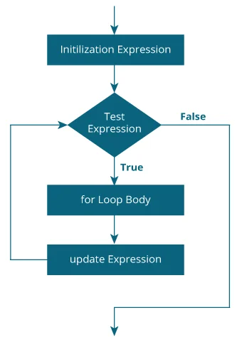

# FOR Statements

The _for_ statements provides a compact a way to iterate over a range of values. Programmers often refer to it as the _"for loop"_ because of the way in which it repeatedly loops until a particular condition is satisfied. The general form of the _for_ statement can be expressed as follows:

```
    for(initialization;termination/condition;increment/decrement){
        statement(s)
    }
```

# - Flowchart



when using this version of the _for_ statements, keep in mind that:

- The _initialization_ expression initializes the loop; it's executed once, as the loop begins.
- When the _termination/condition_ expression evaluates to **False**, the loop terminates.
- The _increment/decrement_ expression is invoked after each iteration through the loop; it is perfectly acceptable for this expression to increment _or_ decrement a value.

The java _for_ loop is used to iterate a part of the program several times. IF the number of iteration is fixed, it is recommended to use for loop.

## Types of For Loop

- Simple For Loop
- For Each or Enhanced for Loop
- Labeled for Loop

**Java Nested For Loop**
if we have a for loop inside the another loop, it is known as nested for loop. The inner loop executes completely whenever outer loop executes.
[nestesforloop](NestedForLoop.java)

The _For_ statement also has anotherform designed for iteration through Collection and arrays. This form is sometimes referred to as the **enhanced** for statement, and can be used to make your loops more compact and easy to read. TO demonstrate, consider the following array, which holds the numbers 1 through 10.

```
    int[] numbers = {1,2,3,4,5,6,7,8,9,19};
```

The program, [EnhancedForDemo](EnhancedForDemo), uses the enhanced _for_ to loop throught the array.
